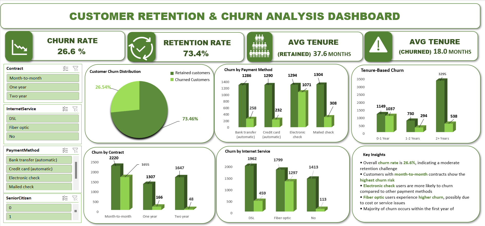

# 🟦 Customer Retention & Churn Analysis – Telco Customer Churn Dataset

## 📌 Project Overview
This project analyzes customer churn and retention patterns using the Telco Customer Churn dataset. The goal is to identify key factors influencing customer behavior and provide actionable insights to improve retention.

---

## 🎯 Objectives
- Analyze customer churn and retention trends  
- Identify key drivers of churn  
- Understand customer lifetime behavior  
- Build an interactive dashboard  
- Provide business recommendations  

---

## 🛠️ Tools Used
- Python (Pandas, Matplotlib)  
- Microsoft Excel (Dashboard)  

---

## 📊 Key Insights
- Churn rate is **26.6%**  
- Month-to-month contracts have highest churn  
- Electronic check users churn more  
- Fiber optic users show higher churn  
- Most churn occurs in early stage  
- Long-term customers show strong retention  

---

## 💡 Business Recommendations
- Promote long-term contracts  
- Improve onboarding experience  
- Encourage automatic payments  
- Improve fiber service quality  
- Focus on early engagement  

---

## 📁 Project Structure
data/telco_customer_churn.csv  
dashboard/churn_dashboard.xlsx  
report/customer_retention_churn_analysis.pdf  
notebook/customer_churn_analysis.ipynb  

---

## 📊 Dashboard Preview

---

## 🚀 Outcome
This project demonstrates how data analytics helps in identifying churn patterns and improving customer retention.

## 👤 Author
Annapurani   
